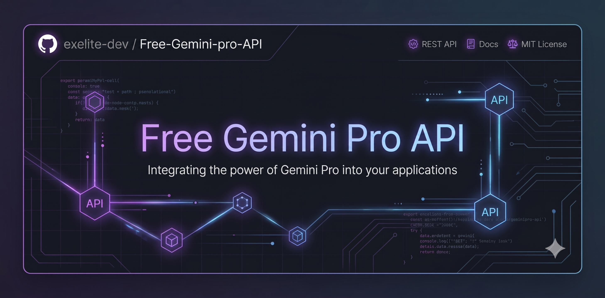

# OmniBridge — پروکسی هوش مصنوعی با API سازگار با OpenAI

<div align="center">

<br>
<a href="README.md"><strong>🇺🇸 Click here for English README</strong></a>
<br>

[](https://python.org)
[](https://fastapi.tiangolo.com)
[](https://t.me/Config_Vortex55)
[](LICENSE)
[](Dockerfile)

**یک پروکسی‌سرور خودمیزبان پرسرعت که Google Gemini را (از طریق کوکی‌های وب) به یک API سازگار با OpenAI و Anthropic تبدیل می‌کند — با داشبورد مدیریت فارسی و زیبا.**

<br>

<br><br>

**📢 کانال تلگرام:** [@Config_Vortex55](https://t.me/Config_Vortex55)

[ویژگی‌ها](#-ویژگیها) · [شروع سریع](#-شروع-سریع) · [مرجع API](#-مرجع-api) · [داشبورد مدیریت](#️-داشبورد-مدیریت) · [دیپلوی](#-دیپلوی-با-یک-کلیک)

</div>

---

## ✨ ویژگی‌ها

| ویژگی | جزئیات |
|--------|---------|
| 🤝 **سازگار با OpenAI** | جایگزین کامل برای `POST /v1/chat/completions` و `GET /v1/models` |
| 🔶 **سازگار با Anthropic** | پشتیبانی کامل از `POST /anthropic/v1/messages` |
| 🌊 **استریم بلادرنگ** | ارسال توکن‌به‌توکن (SSE) روی تمام endpoint‌ها |
| 🔒 **جعل اثرانگشت TLS** | شبیه‌سازی Chrome-120 با `curl-cffi` برای دور زدن bot-detection |
| 🔄 **استخر اکانت‌ها** | توزیع بار Round-Robin با failover خودکار بین اکانت‌های متعدد |
| 🍪 **تمدید خودکار کوکی** | وظیفه پس‌زمینه — هر ۵۵ دقیقه کوکی‌های Gemini را تمدید می‌کند |
| 🗝️ **احراز هویت کلید API** | ساخت و لغو کلیدهای `sk-omni-...` با لاگ کامل |
| 📊 **داشبورد مدیریت** | رابط کاربری تیره با افکت شیشه‌ای، نمودار ترافیک زنده |
| 🖼️ **چندوجهی (Multimodal)** | ورودی تصویر برای مدل‌های Gemini Vision |
| 🐋 **آماده Docker** | Dockerfile چندمرحله‌ای + compose + Render Blueprint |

## 🚀 شروع سریع

### محلی (Python 3.11+)

```bash
git clone https://github.com/exelite-dev/Free-Gemini-pro-API
cd Free-Gemini-pro-API

# نصب وابستگی‌ها
pip install -r requirements.txt

# تنظیم محیط
cp .env.example .env
# فایل .env را باز کرده و ADMIN_PASSWORD و ADMIN_SECRET_KEY را تغییر دهید

# راه‌اندازی
uvicorn app.main:app --host 0.0.0.0 --port 8080 --reload
```

پنل مدیریت: `http://localhost:8080/admin` — ورود: `admin` / `changeme` — سپس اکانت Gemini خود را اضافه کنید.

### Docker Compose

```bash
docker-compose up -d
```

### Docker (تنها کانتینر)

```bash
docker build -t omnibridge .
docker run -d -p 8080:8000 \
  -e ADMIN_PASSWORD=رمزعبور_قوی \
  -e ADMIN_SECRET_KEY=$(openssl rand -hex 32) \
  -v $(pwd)/data:/app/data \
  omnibridge
```

## 🎛️ پیکربندی

### متغیرهای محیطی

| متغیر | پیش‌فرض | توضیح |
|-------|---------|-------|
| `ADMIN_USERNAME` | `admin` | نام کاربری پنل مدیریت |
| `ADMIN_PASSWORD` | `changeme` | رمز عبور پنل مدیریت (**حتماً تغییر دهید!**) |
| `ADMIN_SECRET_KEY` | `supersecretkey` | کلید امضای session (یک رشته تصادفی بلند قرار دهید) |
| `GEMINI_ENABLED` | `true` | فعال/غیرفعال کردن سرویس Gemini |
| `DATABASE_PATH` | `./data/omnibridge.db` | مسیر پایگاه داده SQLite |
| `PORT` | `8080` | پورت سرور |
| `LOG_LEVEL` | `info` | سطح لاگ‌گیری |

تمام تنظیمات را می‌توان در فایل [`config.yaml`](config.yaml) نیز پیکربندی کرد.

## 📡 مرجع API

### احراز هویت

تمام endpoint‌های API نیاز به Bearer token دارند:

```
Authorization: Bearer sk-omni-<کلید-شما>
```

کلیدها را از پنل مدیریت → تب **کلیدهای دسترسی** بسازید.

### لیست مدل‌ها

```bash
GET /v1/models
Authorization: Bearer sk-omni-...
```

### تکمیل چت (فرمت OpenAI)

```bash
POST /v1/chat/completions
Content-Type: application/json
Authorization: Bearer sk-omni-...

{
  "model": "gemini-3.6-flash",
  "messages": [{"role": "user", "content": "سلام!"}],
  "stream": true
}
```

**مدل‌های Gemini موجود:**

| شناسه مدل | توضیح |
|-----------|-------|
| `gemini-3.6-flash` | سریع‌ترین و هوشمندترین (پیش‌فرض پیشنهادی) |
| `gemini-3.1-pro` | بهترین برای کدنویسی و ریاضیات پیچیده |
| `gemini-pro-extended` | حالت تفکر عمیق (Extended Thinking) |
| `gemini-3.5-flash-lite` | سبک‌ترین و سریع‌ترین مدل |
| `gemini-3-pro` | Gemini 3 Pro |
| `gemini-3-flash` | Gemini 3 Flash |
| `gemini-2.5-pro` | Gemini 2.5 Pro |
| `gemini-2.5-flash` | Gemini 2.5 Flash |
| `gemini-1.5-pro` | Gemini 1.5 Pro |
| `gemini-1.5-flash` | Gemini 1.5 Flash |

### پیام‌رسانی (فرمت Anthropic)

```bash
POST /anthropic/v1/messages
Content-Type: application/json
Authorization: Bearer sk-omni-...

{
  "model": "gemini-3.6-flash",
  "messages": [{"role": "user", "content": "سلام!"}],
  "max_tokens": 2048
}
```

## 🛠️ داشبورد مدیریت

آدرس دسترسی: `http://localhost:8080/admin`

| تب | توضیح |
|----|-------|
| **داشبورد** | نمودار ترافیک زنده، نرخ موفقیت، تاخیر، وضعیت سرویس‌ها |
| **مدیریت اکانت‌ها** | افزودن/ویرایش/حذف اکانت‌های Gemini، تست اتصال |
| **راهنمای کوکی** | آموزش تصویری گام‌به‌گام استخراج کوکی‌ها |
| **کلیدهای دسترسی** | ساخت و لغو کلیدهای `sk-omni-...` |
| **اتصال به نرم‌افزارها** | تنظیمات آماده برای Cursor IDE، NextChat، پایتون و... |
| **محیط تست (Playground)** | چت زنده با استریم — تست مستقیم مدل‌ها |
| **راهنمای دیپلوی** | آموزش کامل میزبانی روی Render، Hugging Face، VPS |

## 🍪 دریافت کوکی‌های Gemini

1. وارد [gemini.google.com](https://gemini.google.com) با اکانت Google خود شوید
2. کلید `F12` را بزنید تا DevTools باز شود
3. تب **Application** → **Cookies** → `gemini.google.com`
4. مقادیر `__Secure-1PSID` و `__Secure-1PSIDTS` را کپی کنید
5. در پنل مدیریت → **مدیریت اکانت‌ها** وارد کنید

> **نکته:** راهنمای تصویری کامل در تب **راهنمای کوکی** داشبورد مدیریت موجود است.

## 🚢 دیپلوی با یک کلیک

### Render.com (پیشنهادی — رایگان)

[](https://render.com/deploy?repo=https://github.com/exelite-dev/Free-Gemini-pro-API)

1. این ریپوزیتوری را Fork کنید
2. روی دکمه بالا کلیک کنید
3. Runtime را **Docker** انتخاب کنید
4. متغیرهای `ADMIN_PASSWORD` و `ADMIN_SECRET_KEY` را تنظیم کنید
5. **Create Web Service** — سرور شما آنلاین است!

### VPS / خودمیزبان

```bash
git clone https://github.com/exelite-dev/Free-Gemini-pro-API
cd Free-Gemini-pro-API
cp .env.example .env
nano .env  # ADMIN_PASSWORD و ADMIN_SECRET_KEY را تنظیم کنید
docker compose up -d --build
```

### Hugging Face Spaces (Docker SDK)

1. یک Space جدید بسازید → SDK: **Docker**
2. فایل‌های پروژه را آپلود یا push کنید
3. در Dockerfile، پورت را به `7860` تغییر دهید
4. Secrets را از طریق تنظیمات Space ست کنید

## 📁 ساختار پروژه

```
OmniBridge/
├── app/
│   ├── main.py              # FastAPI factory + lifespan
│   ├── config.py            # تنظیمات (env + YAML)
│   ├── database.py          # SQLite async (اکانت‌ها، کلیدها، متریک‌ها)
│   ├── models.py            # اسکیماهای Pydantic
│   ├── auth.py              # احراز هویت کلید API و session
│   ├── providers/
│   │   ├── base.py          # کلاس پایه + استثناها
│   │   ├── pool.py          # استخر اکانت با توزیع بار
│   │   ├── registry.py      # رجیستری ارائه‌دهندگان
│   │   └── gemini/
│   │       ├── engine.py    # موتور TLS، احراز هویت کوکی، استریم
│   │       └── cookie_refresh.py  # تمدید خودکار کوکی
│   ├── routes/
│   │   ├── openai.py        # /v1/chat/completions، /v1/models
│   │   ├── anthropic.py     # /anthropic/v1/messages
│   │   └── admin.py         # API مدیریت + سرو HTML
│   └── admin/
│       ├── static/css/      # سیستم طراحی glassmorphic
│       └── templates/       # SPA مدیریت (Jinja2 + vanilla JS)
├── tests/
│   └── test_app.py          # تست‌های یونیت و یکپارچگی
├── config.yaml              # پیکربندی پیش‌فرض
├── .env.example             # نمونه متغیرهای محیطی
├── requirements.txt
├── Dockerfile               # ساخت چندمرحله‌ای
├── docker-compose.yml
├── render.yaml              # Render Blueprint
├── README.md                # مستندات انگلیسی
└── README.fa.md             # این فایل (فارسی)
```

## 🔒 نکات امنیتی

- **حتماً** `ADMIN_PASSWORD` و `ADMIN_SECRET_KEY` را قبل از هر deploy عمومی تغییر دهید
- فایل `.env` را در git commit نکنید (در `.gitignore` قرار دارد)
- در محیط production، پشت یک reverse proxy (nginx / Caddy) با TLS اجرا کنید
- کلید پیش‌فرض `sk-test` فقط برای توسعه محلی است — در محیط production آن را حذف یا لغو کنید

## 🧪 اجرای تست‌ها

```bash
pip install pytest
python -m pytest tests/ -v
```

## 📄 مجوز

مجوز MIT — جزئیات در فایل [LICENSE](LICENSE).

## 📢 کانال تلگرام

برای دریافت آپدیت، آموزش، و پشتیبانی: [@Config_Vortex55](https://t.me/Config_Vortex55)
