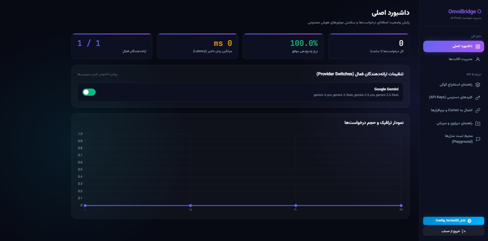

# OmniBridge

<div align="center">


<br>
<a href="README.fa.md"><strong>🇮🇷 برای مطالعه راهنمای فارسی اینجا کلیک کنید</strong></a>
<br>

[](https://python.org)
[](https://fastapi.tiangolo.com)
[](https://t.me/Config_Vortex55)
[](LICENSE)
[](Dockerfile)
[](https://platform.openai.com/docs/api-reference)
[](https://docs.anthropic.com)

**A high-performance, self-hosted AI proxy server that exposes Google Gemini (via web session cookies) as a fully OpenAI-compatible and Anthropic-compatible API — complete with a beautiful Persian admin dashboard.**

<br>

<br><br>

**📢 Official Telegram Channel:** [@Config_Vortex55](https://t.me/Config_Vortex55)

[Features](#-features) · [Quick Start](#-quick-start) · [API Reference](#-api-reference) · [Admin Dashboard](#️-admin-dashboard) · [Deploy](#-one-click-deploy)

</div>

---

## ✨ Features

| Feature | Details |
|---------|---------|
| 🤝 **OpenAI Compatible** | Drop-in replacement for `POST /v1/chat/completions` and `GET /v1/models` |
| 🔶 **Anthropic Compatible** | Full `POST /anthropic/v1/messages` support |
| 🌊 **Real-time Streaming** | Token-by-token SSE streaming on all endpoints |
| 🔒 **TLS Fingerprinting** | `curl-cffi` Chrome-120 impersonation — bypasses bot detection |
| 🔄 **Account Pooling** | Round-robin load balancing + automatic failover across multiple accounts |
| 🍪 **Cookie Auto-Refresh** | Background task validates & refreshes Gemini cookies every 55 minutes |
| 🗝️ **API Key Auth** | Generate/revoke `sk-omni-...` keys with full audit trail |
| 📊 **Admin Dashboard** | Glassmorphic dark-mode Persian UI with live traffic charts |
| 🖼️ **Multi-modal** | Image input support via Gemini Vision models |
| 🐋 **Docker Ready** | Multi-stage Dockerfile + compose + Render Blueprint |

## 🏗️ Architecture

```
┌─────────────────────────────────────────────────────┐
│                    OmniBridge                       │
│                                                     │
│  ┌──────────┐    ┌──────────────────────────────┐   │
│  │ OpenAI   │    │         FastAPI App          │   │
│  │ /v1/...  │───▶│                              │   │
│  └──────────┘    │  ┌────────────────────────┐  │   │
│  ┌──────────┐    │  │    Gemini Engine       │  │   │
│  │Anthropic │───▶│  │  + Account Pool        │  │   │
│  │ /anth... │    │  │  + Cookie Auto-Refresh │  │   │
│  └──────────┘    │  └────────────────────────┘  │   │
│  ┌──────────┐    │         │                    │   │
│  │  Admin   │───▶│         ▼                    │   │
│  │  /admin  │    │  SQLite (aiosqlite) DB       │   │
│  └──────────┘    └──────────────────────────────┘   │
└─────────────────────────────────────────────────────┘
```

## 🚀 Quick Start

### Local (Python 3.11+)

```bash
git clone https://github.com/exelite-dev/Free-Gemini-pro-API
cd Free-Gemini-pro-API

# Install dependencies
pip install -r requirements.txt

# Configure
cp .env.example .env
# Edit .env: set ADMIN_PASSWORD and ADMIN_SECRET_KEY

# Run
uvicorn app.main:app --host 0.0.0.0 --port 8080 --reload
```

Open `http://localhost:8080/admin` → login (`admin` / `changeme`) → add your Gemini account.

### Docker Compose

```bash
docker-compose up -d
```

### Docker (single container)

```bash
docker build -t omnibridge .
docker run -d -p 8080:8000 \
  -e ADMIN_PASSWORD=mysecretpassword \
  -e ADMIN_SECRET_KEY=$(openssl rand -hex 32) \
  -v $(pwd)/data:/app/data \
  omnibridge
```

## 🎛️ Configuration

### Environment Variables

| Variable | Default | Description |
|----------|---------|-------------|
| `ADMIN_USERNAME` | `admin` | Admin dashboard username |
| `ADMIN_PASSWORD` | `changeme` | Admin dashboard password (**change this!**) |
| `ADMIN_SECRET_KEY` | `supersecretkey` | Session signing key (use a long random string) |
| `GEMINI_ENABLED` | `true` | Enable Gemini provider |
| `DATABASE_PATH` | `./data/omnibridge.db` | SQLite database path |
| `PORT` | `8080` | Server port |
| `LOG_LEVEL` | `info` | Logging verbosity |

All settings can also be configured in [`config.yaml`](config.yaml).

## 📡 API Reference

### Authentication

All API endpoints require a Bearer token:

```
Authorization: Bearer sk-omni-<your-key>
```

Generate keys at `/admin` → **API Keys** tab.

### List Models

```bash
GET /v1/models
Authorization: Bearer sk-omni-...
```

Returns all models for currently enabled providers.

### Chat Completions (OpenAI format)

```bash
POST /v1/chat/completions
Content-Type: application/json
Authorization: Bearer sk-omni-...

{
  "model": "gemini-3.6-flash",
  "messages": [{"role": "user", "content": "Hello!"}],
  "stream": true
}
```

**Available Gemini models:**
| Model ID | Description |
|----------|-------------|
| `gemini-3.6-flash` | Fastest all-rounder (recommended default) |
| `gemini-3.1-pro` | Advanced reasoning, math & code |
| `gemini-pro-extended` | Extended thinking / deep reasoning |
| `gemini-3.5-flash-lite` | Ultra-fast, minimal latency |
| `gemini-3-pro` | Gemini 3 Pro |
| `gemini-3-flash` | Gemini 3 Flash |
| `gemini-2.5-pro` | Gemini 2.5 Pro |
| `gemini-2.5-flash` | Gemini 2.5 Flash |
| `gemini-1.5-pro` | Gemini 1.5 Pro |
| `gemini-1.5-flash` | Gemini 1.5 Flash |

### Messages (Anthropic format)

```bash
POST /anthropic/v1/messages
Content-Type: application/json
Authorization: Bearer sk-omni-...

{
  "model": "gemini-3.6-flash",
  "messages": [{"role": "user", "content": "Hello!"}],
  "max_tokens": 2048
}
```

### cURL Example

```bash
curl http://localhost:8080/v1/chat/completions \
  -H "Authorization: Bearer sk-omni-xxxx" \
  -H "Content-Type: application/json" \
  -d '{"model":"gemini-3.6-flash","messages":[{"role":"user","content":"Say hello"}],"stream":false}'
```

## 🛠️ Admin Dashboard

Access at `http://localhost:8080/admin`

| Tab | Description |
|-----|-------------|
| **Dashboard** | Live request volume chart, success rate, latency, provider health |
| **Accounts** | Add/edit/delete Gemini accounts, test connections |
| **Cookie Guide** | Step-by-step cookie extraction guide with screenshots |
| **API Keys** | Generate `sk-omni-...` keys, revoke old keys |
| **Integration** | Copy-ready config for Cursor IDE, NextChat, Python scripts |
| **Playground** | Live streaming chat — test any model directly |
| **Deploy Guide** | Hosting instructions for Render, Hugging Face, VPS |

## 🍪 Getting Gemini Credentials

1. Log into [gemini.google.com](https://gemini.google.com) with your Google account
2. Open DevTools (`F12`) → **Application** tab → **Cookies** → `gemini.google.com`
3. Copy the values of `__Secure-1PSID` and `__Secure-1PSIDTS`
4. Go to Admin Dashboard → **Accounts** → add them

> **Tip:** The admin panel has a built-in visual guide with screenshots under the **Cookie Guide** tab.

## 🚢 One-Click Deploy

### Render (Recommended — Free)

[](https://render.com/deploy?repo=https://github.com/exelite-dev/Free-Gemini-pro-API)

1. Fork this repository
2. Click the button above (or go to [render.com](https://dashboard.render.com) → New → Web Service → connect your fork)
3. Set runtime to **Docker**
4. Add environment variables: `ADMIN_PASSWORD`, `ADMIN_SECRET_KEY`
5. Click **Create Web Service** — your proxy is live!

### Railway

[](https://railway.app/new/template?template=https://github.com/exelite-dev/Free-Gemini-pro-API)

### VPS / Self-Hosted

```bash
git clone https://github.com/exelite-dev/Free-Gemini-pro-API
cd Free-Gemini-pro-API
cp .env.example .env
nano .env  # set ADMIN_PASSWORD and ADMIN_SECRET_KEY
docker compose up -d --build
```

### Hugging Face Spaces (Docker SDK)

1. Create a new Space → SDK: **Docker**
2. Push or upload the project files
3. In the Dockerfile, change `EXPOSE 8000` to `EXPOSE 7860` and update the CMD port accordingly
4. Set Space Secrets for `ADMIN_PASSWORD` and `ADMIN_SECRET_KEY`

## 📁 Project Structure

```
OmniBridge/
├── app/
│   ├── main.py              # FastAPI app factory + lifespan
│   ├── config.py            # Config (env + YAML, single source of truth)
│   ├── database.py          # Async SQLite (accounts, keys, metrics)
│   ├── models.py            # Pydantic schemas (OpenAI + Anthropic)
│   ├── auth.py              # API key + admin session auth
│   ├── providers/
│   │   ├── base.py          # Abstract provider + exceptions
│   │   ├── pool.py          # Round-robin account pool + failover
│   │   ├── registry.py      # Provider registry
│   │   └── gemini/
│   │       ├── engine.py    # curl-cffi TLS, cookie auth, streaming
│   │       └── cookie_refresh.py  # Background auto-refresh task
│   ├── routes/
│   │   ├── openai.py        # /v1/chat/completions, /v1/models
│   │   ├── anthropic.py     # /anthropic/v1/messages
│   │   └── admin.py         # Admin REST API + SPA serving
│   └── admin/
│       ├── static/css/      # Glassmorphic design system
│       └── templates/       # Admin SPA (Jinja2 + vanilla JS)
├── tests/
│   └── test_app.py          # Unit & integration tests
├── config.yaml              # Default provider/model config
├── .env.example             # Environment variable template
├── requirements.txt
├── Dockerfile               # Multi-stage build
├── docker-compose.yml
├── render.yaml              # Render Blueprint
├── README.md
└── README.fa.md             # Persian README
```

## 🔒 Security Notes

- **Change** `ADMIN_PASSWORD` and `ADMIN_SECRET_KEY` before any public deployment
- Never commit `.env` to version control (it's in `.gitignore`)
- In production, run behind a reverse proxy (nginx / Caddy) with TLS termination
- The default `sk-test` key is for local development only — revoke or replace it in production
- Gemini cookies are stored encrypted-equivalent in SQLite; rotate them via the admin panel periodically

## 🧪 Running Tests

```bash
pip install pytest pytest-anyio
python -m pytest tests/ -v
```

## 📄 License

MIT License — see [LICENSE](LICENSE) for details.

## 📢 Community

- **Telegram:** [@Config_Vortex55](https://t.me/Config_Vortex55) — updates, tips, and support
